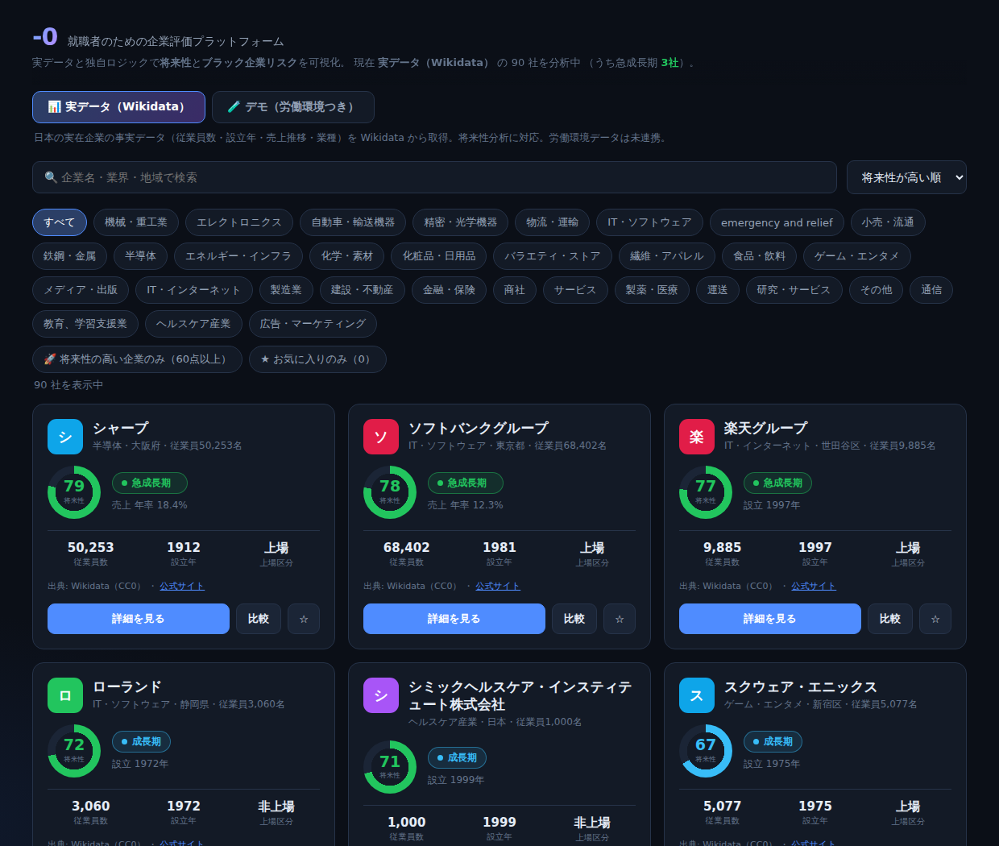
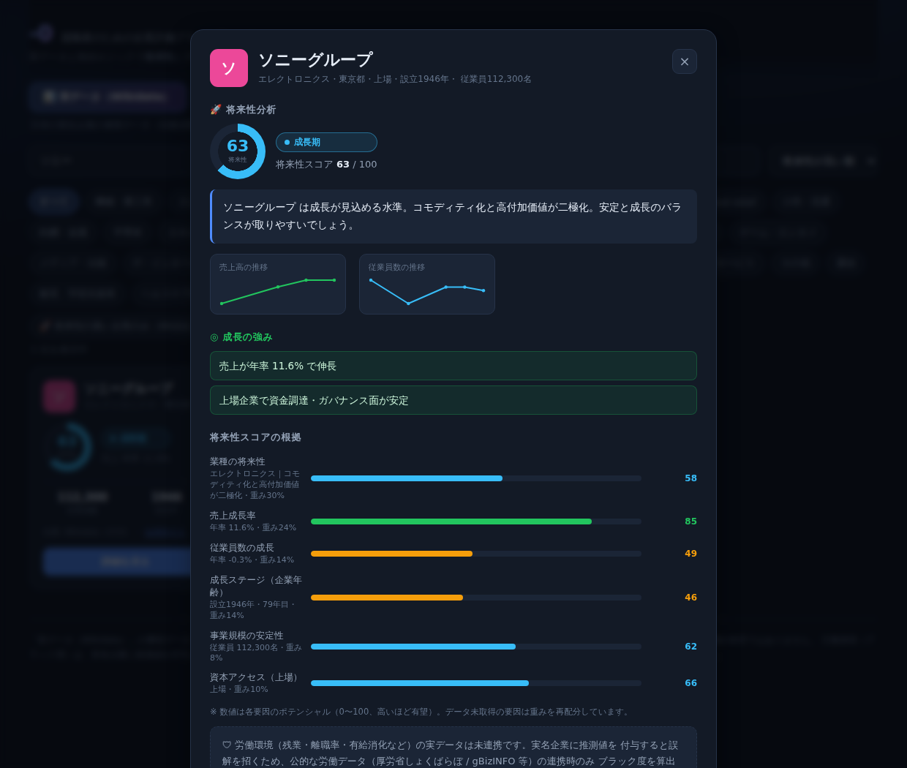

# -0（ゼロ） — 就職者のための企業評価プラットフォーム

就職者のために、企業の**将来性**と**ブラック企業リスク**を可視化する Web アプリです。
**実在企業の事実データ（Wikidata）** をベースに、スコアはブラックボックスにせず
**各指標の寄与を必ず開示**します。



## 2 つの分析軸

1. **🚀 将来性分析** — 実データ（従業員数・売上推移・設立年・上場・業種）から
   「将来性スコア 0–100」と成長ステージ（急成長期／成長期／成熟・安定／転換期）を算出。
2. **🛡 ブラック度分析** — 労働指標（残業・離職率・有給・残業代など）から
   「ブラック度スコア 0–100」を算出し、危険な企業を警告。

## 実データ化（Wikidata）

- 日本の**実在企業の事実データ**を Wikidata SPARQL（無認証・CC0）から取得。
  取得パイプラインは [`scripts/fetch-companies.mjs`](scripts/fetch-companies.mjs)。
  従業員数・売上高は**複数年の推移**を保持し、成長率（CAGR）算出に使用。
- ヘッダーで「**実データ（Wikidata）**」と「**デモ（労働環境つき）**」を切替可能。
- **労働データの扱い**: Wikidata に労働指標は無い。実名企業に推測値を付与すると
  名誉毀損リスクがあるため、実データ企業には労働指標を付与せず「未連携」とし、
  公的労働データ（厚労省しょくばらぼ / gBizINFO 等）の連携時のみブラック度を算出する。
  ブラック度評価は**デモデータ**でフルに体験できる。

```bash
node scripts/fetch-companies.mjs   # Wikidata から実データを再取得
```

## 主な機能

- **将来性スコア＆成長ステージ** — 売上・従業員の推移をスパークラインで可視化
- **ブラック度スコア（0–100）** — 9 指標を重み付け、4 段階のリスク区分で表示
- **危険信号（レッドフラグ）** — 過労死ライン超え・サービス残業・高離職率・労基署是正勧告などを警告
- **スコアの根拠を開示** — 各要因のポテンシャル／リスクポイントと重みを可視化
- **企業比較** — 最大 4 社を並べて比較（将来性・労働環境の最良値をハイライト）
- **検索・絞り込み・並び替え** — 業界／地域／キーワード、「将来性の高い企業のみ」「安全な企業のみ」表示
- **お気に入り** — localStorage に保存（サーバー不要）

## ブラック企業スコアリング

| 指標 | 重み | 考え方 |
| --- | --- | --- |
| 月平均残業時間 | 20% | 45h 超で警告、80h 超で過労死ライン |
| 3年以内離職率 | 18% | 高いほど定着せず実態が悪い |
| 有給休暇消化率 | 12% | 低いほど休めない |
| 残業代支給率 | 12% | 低い＝サービス残業の疑い |
| 平均勤続年数 | 10% | 短い＝使い捨て傾向 |
| ハラスメント指数 | 10% | 従業員あたりの報告件数 |
| 労基署 是正勧告 | 10% | 直近 5 年の法令違反歴 |
| 万年採用 | 4% | 常時大量採用は高離職の兆候 |
| 社会保険 完備 | 4% | 未整備は基礎的な問題 |

各指標を「リスクポイント 0–100（高いほど悪い）」へ正規化し、重み付き平均で
**ブラック度スコア**を出します。ホワイト度 = 100 − ブラック度。ロジックは
`src/engine/scoring.ts` にあり、`src/engine/scoring.test.ts` でテスト済みです。

危険な企業は、根拠となる危険信号とスコアの内訳を明示して警告します。


## 将来性スコアリング

`src/engine/growth.ts`。実データから各要因を「ポテンシャル 0–100（高いほど有望）」に
正規化し、動的に再正規化した重みで平均します（データ欠損の要因は除外）。

| 要因 | 基準重み | 入力 |
| --- | --- | --- |
| 業種の将来性 | 30% | 業種アウトルック表（`industry.ts`・編集可能） |
| 売上成長率 | 24% | 売上高 CAGR（単位不整合の外れ値を除外） |
| 従業員数の成長 | 14% | 従業員数 CAGR |
| 成長ステージ | 14% | 企業年齢（設立年） |
| 事業規模の安定性 | 8% | 従業員数 |
| 資本アクセス | 10% | 上場の有無 |

実データ（Wikidata の売上・従業員推移）から成長率を計算し、根拠を開示します。



### リスク区分

| ブラック度 | 区分 |
| --- | --- |
| 0–24 | 優良（ホワイト） |
| 25–44 | 標準 |
| 45–64 | 要注意 |
| 65–100 | ブラック危険 |

## 技術構成

- Vite + React + TypeScript
- スタイルは自前の CSS デザインシステム（依存最小・ビルド安定）
- Vitest（スコアリングエンジンのユニットテスト 23 件）
- 実データ: Wikidata SPARQL（`scripts/fetch-companies.mjs` → `companies.generated.json`）
- データ層を分離（`src/data/index.ts`）。実データ／デモを切替でき、将来 API / DB / ユーザー投稿へ拡張可能

## 開発

```bash
npm install
npm run dev       # 開発サーバー
npm test          # スコアリングエンジンのテスト
npm run build     # 型チェック + 本番ビルド
npm run preview   # 本番ビルドのプレビュー
```

## ロードマップ

計画の詳細は [`docs/PLAN.md`](docs/PLAN.md) を参照。

1. 公的労働データ連携（厚労省しょくばらぼ / gBizINFO / EDINET）で実名企業のブラック度も算出
2. 厚労省「労働基準関係法令違反に係る公表事案」を根拠にした証拠ベースの警告
3. ユーザー投稿型の口コミ・実残業時間の収集と集計
4. バックエンド API + DB 化、地域・職種別の統計
5. モバイルアプリ（同エンジンを再利用）

## 注意

本アプリのスコアは提供された労働指標に基づく**参考値**です。掲載企業はすべて
**架空**であり、実在の企業・団体とは一切関係ありません。実データを導入する際は、
出典の明示・名誉毀損への配慮・企業側の反論掲載の仕組みを併せて実装する前提です。
